# RETO 01 CTF UNEX 2024

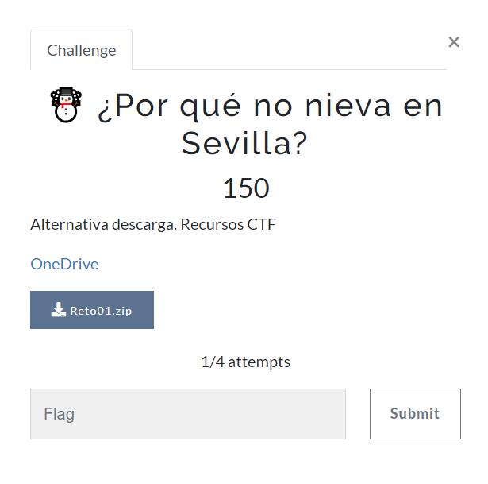

Descargo los ficheros que nos dan: Reto01.zip y los descomprimo en mi carpeta de trabajo para este reto.

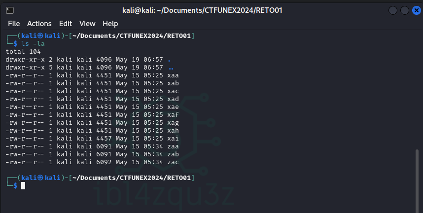

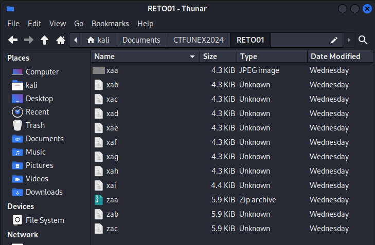

Veo que aparece uno que lo reconce como imagen y otro como zip, pero estan incompletos, parece como si hubieran sido "cortados" en tamaños iguales.

## Archivo X

Compruebo el primero viendo que aparece un trozo de una imagen.


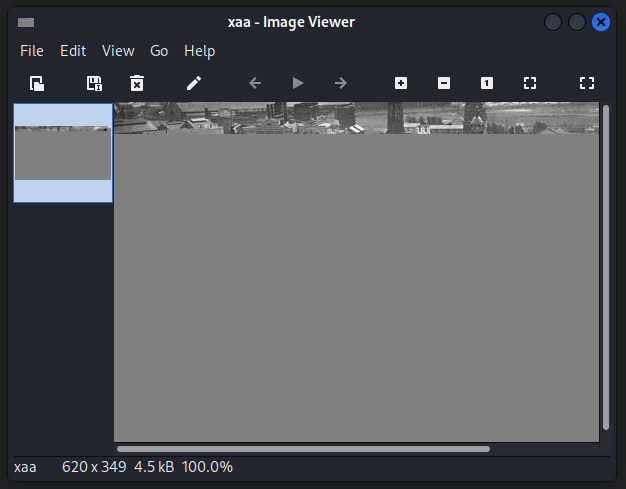


Uno los ficheros que empiezan por la misma letra con el comando:

```bash
cat x* > x.jpg
```

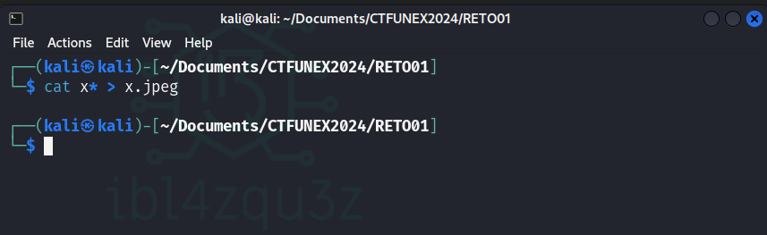

Compruebo el fichero obtenido y veo que es una imagen

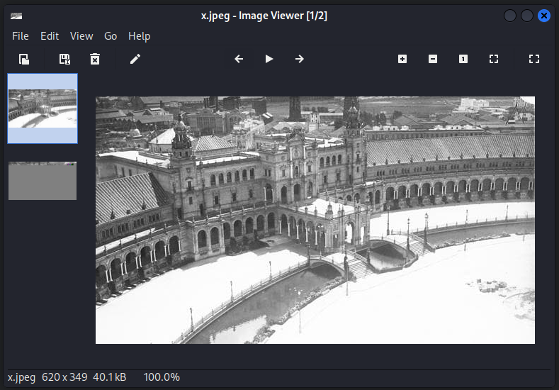

Es la plaza de españa de sevilla nevada. 

Compruebo Strings

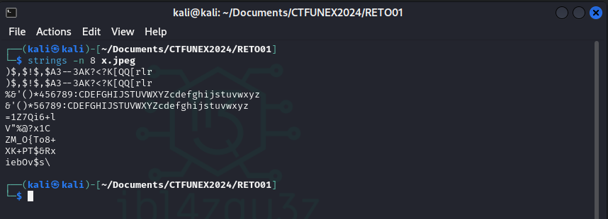

Compruebo con binwalk por si hubiera algo escondido.

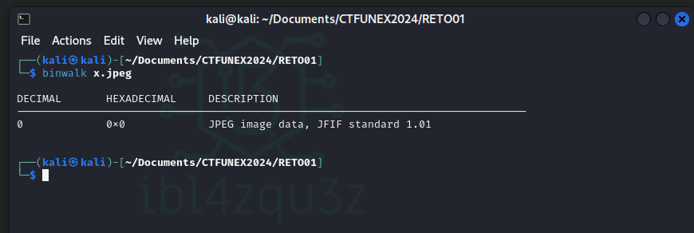

Compruebo con exiftool por si hubiera algo importante en los metadatos.

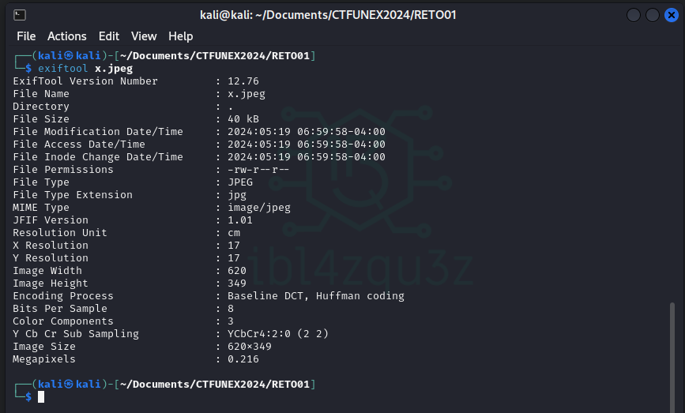

En esta imagen parece que no hay nada reseñable, la dejo a un lado de momento por si fuera necesario mas adelante.

## Archivo Z


Uno los ficheros que empiezan por la misma letra con el comando:

```bash
cat z* > x.jpg
```

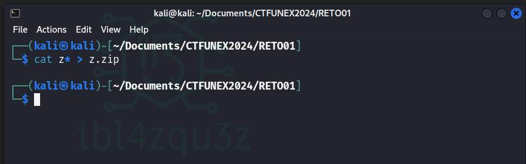

Descomprimo el zip y tengo una imagen llamada snow.jpg

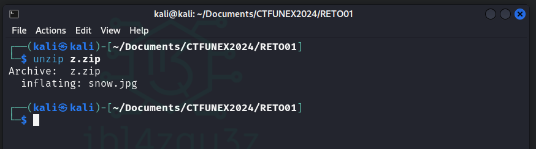

Comprobamos la imagen por si fuera la flag.

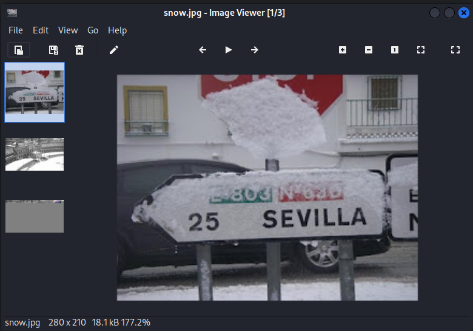

Tiro un strings -n 10 snow.jpg y aparece algo interesante

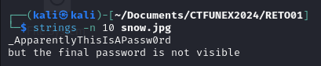

Nos da una "clave" : `_ApparentlyThisIsAPassw0rd`

Ynos dice que la clave final no esta visible, es decir que la flag esta oculta.

Voy a usar la herramienta "stegsolve" que sirve para ver capas de la imagen y asi poder encontrar algun mensaje oculto en capas.

Esta herramienta la podemos encontrar en: 
 [https://github.com/zardus/ctf-tools/blob/master/stegsolve/install]

Nos indica para instalarla hacer lo siguiente:

```bash
wget http://www.caesum.com/handbook/Stegsolve.jar -O stegsolve.jar
chmod +x stegsolve.jar
mkdir bin
mv stegsolve.jar bin/
```

Una vez realizado solo tengo que ir a la carpeta bin y ejecutar la aplicacion con:

```bash
java -jar stegsolve.jar
```

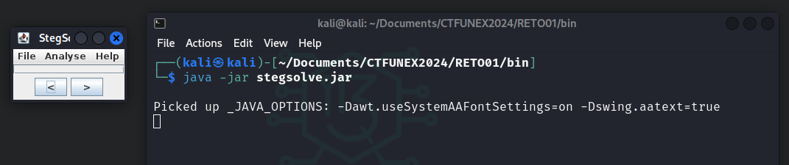

Esto abre una aplicacion en la que tenemos elegir la imagen e ir pasando capa a capa

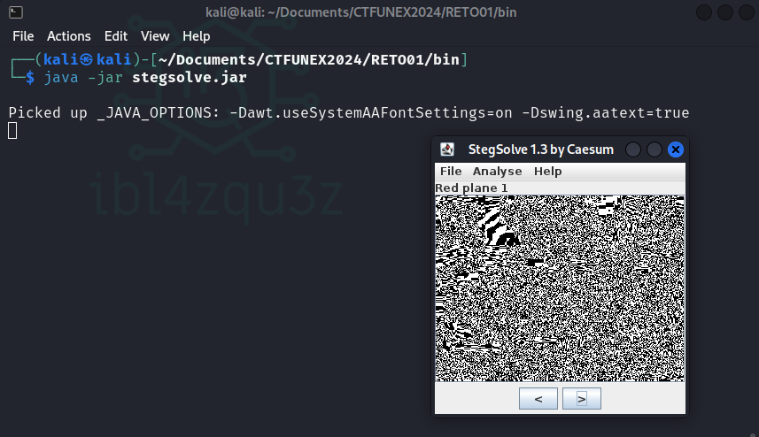

Despues de revisar esta imagen y la anterior no hay nada en las capas que sea la flag.

Como hay una clave busque en google por herramientas que oculta archivos en otros protegiendolos con clave.

La herramienta se llama “Steghide” (https://pkg.kali.org/pkg/steghide)

La instalo en kali:

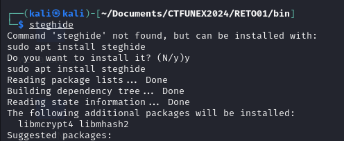

y miro la documentacion de como se usa:

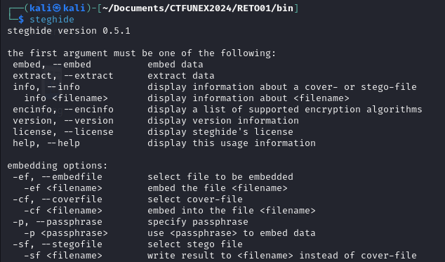

Tiro el comando:

steghide extract -sf x.jpg 

Me pide una clave y escribo la clave que encontramos en snow.jpg:  `_ApparentlyThisIsAPassw0rd`

Y me dice que ha escrito los datos en flag.txt,

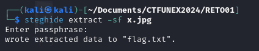

Miro el fichero con un `cat`

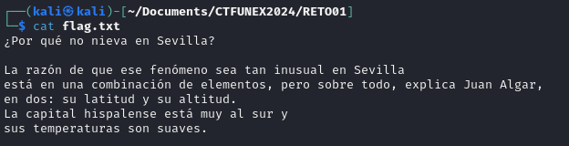

Compruebo con `nano` y aparecen unas marcas en rojo como si se hubieran añadido espacios.

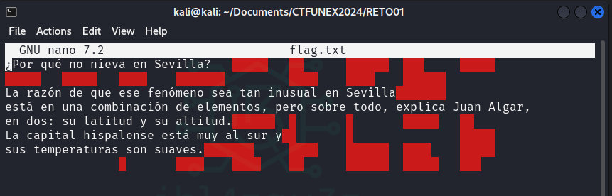

Abro el fichero con un editor de hexadecimal por si hubiera contenido escondido en valores hexadecimales.

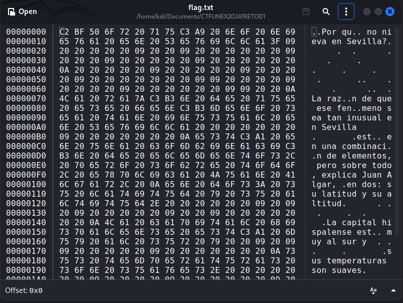

Existe un metodo de ocultación de mensajes mediante el método “whitespace”, que no es visible a la vista, pero con cualquier editor de texto en terminal es posible observar en color rojo aquellos lugares en blanco. 

Por lo que estaba ante una ocultacion en espacios en blanco.

Mediante la herramienta stegsnow (casualmente snow como el fichero original desde donde partimos) realizo una extraccion 

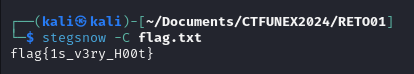

Y hemos obtenido la flag: **flag{1s_v3ry_H00t}**

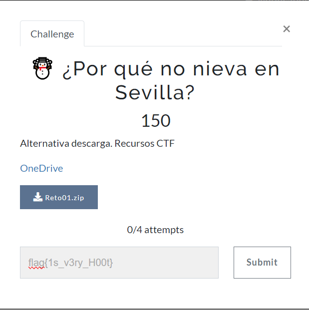

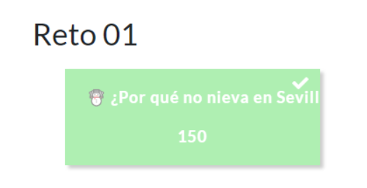

**RETO COMPLETADO!**