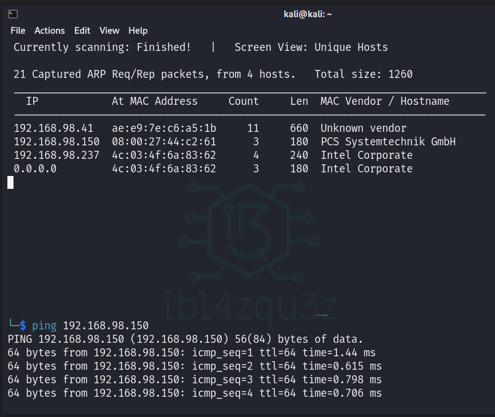
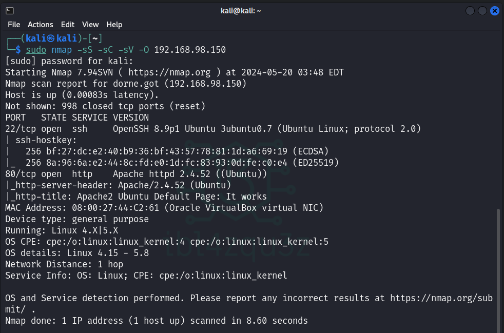
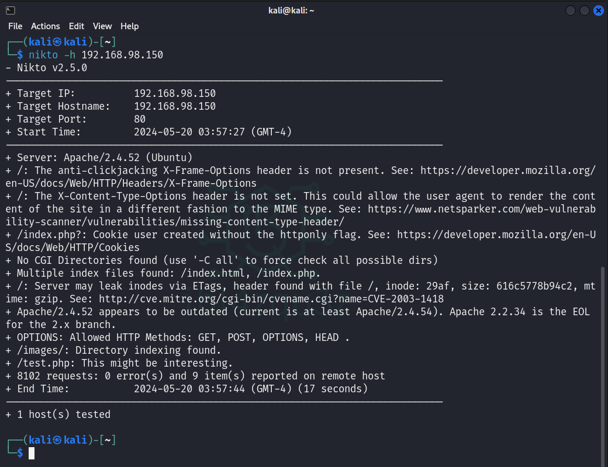
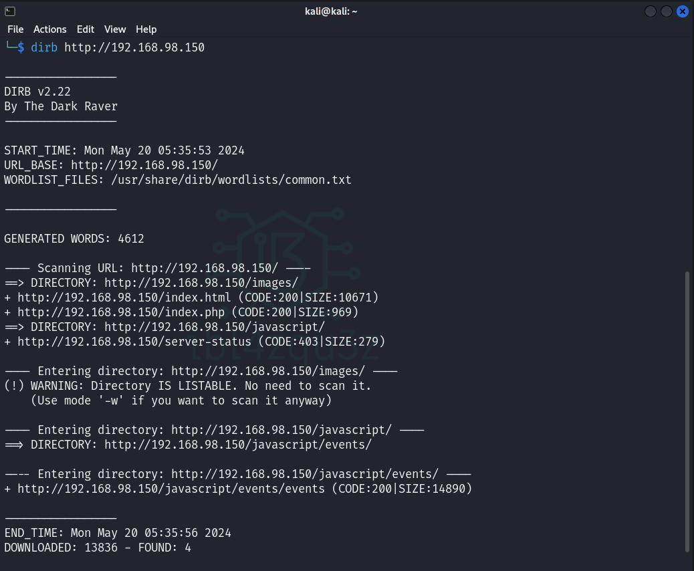
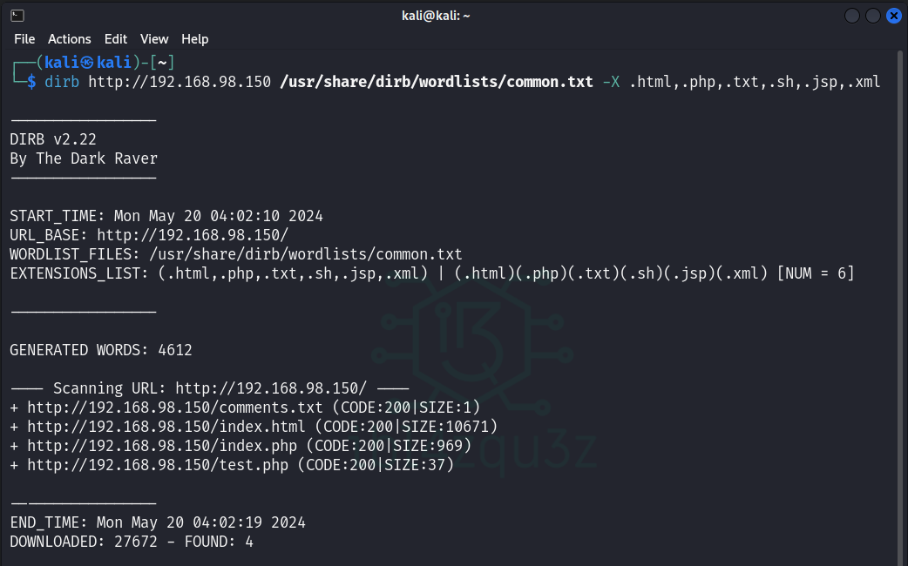

# RETO 04 CTF UNEX 2024

En este reto, debes intentar encontrar 4 nuevas banderas.

Para poder realizar el reto correctamente, debes seguir los siguientes pasos:

La máquina virtual debe tener un adaptador de red en modo bridge

- Flag 1 -> 150 puntos
- Flag 2 -> 200 puntos
- Flag 3 -> 300 puntos
- Flag 4 -> 400 puntos

---

Descargo la máquina y configuro según las indicaciones:


La maquina nos indica su IP en la red en pantalla, de todas formas compruebo que puedo realizar ping desde mi maquina de pentesting kali.



## Escaneo de puertos y servicios

Realizo un escaneo de la maquina mediante **escaneo sigiloso** o **stealth scan** (-sS) y tambien aprovecho para detectar servicios (-sV), y le añado que me de mas informacion usando scritps predeterminados de Nmap (-sC), y ademas que me de informacion sobre el sistema operativo (-O).

```bash
sudo nmap -sS -sC -sV -O 192.168.98.150
```



```bash
Starting Nmap 7.94SVN ( https://nmap.org ) at 2024-05-20 03:48 EDT
Nmap scan report for dorne.got (192.168.98.150)
Host is up (0.00083s latency).
Not shown: 998 closed tcp ports (reset)
PORT   STATE SERVICE VERSION
22/tcp open  ssh     OpenSSH 8.9p1 Ubuntu 3ubuntu0.7 (Ubuntu Linux; protocol 2.0)
| ssh-hostkey: 
|   256 bf:27:dc:e2:40:b9:36:bf:43:57:78:81:1d:a6:69:19 (ECDSA)
|_  256 8a:96:6a:e2:44:8c:fd:e0:1d:fc:83:93:0d:fe:c0:e4 (ED25519)
80/tcp open  http    Apache httpd 2.4.52 ((Ubuntu))
|_http-server-header: Apache/2.4.52 (Ubuntu)
|_http-title: Apache2 Ubuntu Default Page: It works
MAC Address: 08:00:27:44:C2:61 (Oracle VirtualBox virtual NIC)
Device type: general purpose
Running: Linux 4.X|5.X
OS CPE: cpe:/o:linux:linux_kernel:4 cpe:/o:linux:linux_kernel:5
OS details: Linux 4.15 - 5.8
Network Distance: 1 hop
Service Info: OS: Linux; CPE: cpe:/o:linux:linux_kernel

OS and Service detection performed. Please report any incorrect results at https://nmap.org/submit/ .
Nmap done: 1 IP address (1 host up) scanned in 8.60 seconds
```

Como vemos en el resultado nos da un puerto 80 y un puerto 22 abiertos.

En el puerto 80 se esta ejecutando un servidor Apache 2.4.52
En el puerto 22 se esta ejecutando un servicio OpenSSH 8.9p1
El sistema operativo de la maquina es Linux y la version esta entre la 4.15 y 5.18

## Escaneo con nikto

nikto -h 192.168.98.150



Resultados:

+ Server: Apache/2.4.52 (Ubuntu)
+ /: The anti-clickjacking X-Frame-Options header is not present. See: https://developer.mozilla.org/en-US/docs/Web/HTTP/Headers/X-Frame-Options
+ /: The X-Content-Type-Options header is not set. This could allow the user agent to render the content of the site in a different fashion to the MIME type. See: https://www.netsparker.com/web-vulnerability-scanner/vulnerabilities/missing-content-type-header/
+ /index.php?: Cookie user created without the httponly flag. See: https://developer.mozilla.org/en-US/docs/Web/HTTP/Cookies
+ No CGI Directories found (use '-C all' to force check all possible dirs)
+ Multiple index files found: /index.html, /index.php.
+ /: Server may leak inodes via ETags, header found with file /, inode: 29af, size: 616c5778b94c2, mtime: gzip. See: http://cve.mitre.org/cgi-bin/cvename.cgi?name=CVE-2003-1418
+ Apache/2.4.52 appears to be outdated (current is at least Apache/2.4.54). Apache 2.2.34 is the EOL for the 2.x branch.
+ OPTIONS: Allowed HTTP Methods: GET, POST, OPTIONS, HEAD .
+ /images/: Directory indexing found.
+ /test.php: This might be interesting.

Hallazgos:

+ /index.php
+ /images/: Directory indexing found.
+ /test.php: This might be interesting.

## Enumeracion de directorios y paginas

```bash
dirb http://192.168.98.150
```



Tambien puedo hacer una busqueda mas enfocada en ciertos archivos mediante el uso de diccionarios y enfocando a ciertos elementos.

```bash
dirb http://192.168.98.150 /usr/share/dirb/wordlists/common.txt -X .html,.php,.txt,.sh,.jsp,.xml
```



```bash
dirb http://192.168.98.150 /usr/share/dirb/wordlists/big.txt -X .html,.php,.txt,.sh,.jsp,.xml,.js
```


Uso la herramienta dirsearch por si existieran otros directorios que dirb no los haya detectado.

```bash
dirsearch -u http://192.168.98.150 -i200,301
```

```

  _|. _ _  _  _  _ _|_    v0.4.3                                                                  
 (_||| _) (/_(_|| (_| )                                                                           
                                                                                                  
Extensions: php, aspx, jsp, html, js | HTTP method: GET | Threads: 25 | Wordlist size: 11460

Output File: /home/kali/Documents/CTFUNEX2024/RETO04/reports/http_192.168.98.150/_24-05-19_10-17-3

Target: http://192.168.98.150/

[10:17:35] Starting:                                                                              
[10:17:55] 301 -  317B  - /images  ->  http://192.168.98.150/images/        
[10:17:55] 200 -  516B  - /images/                                          
[10:17:56] 200 -  519B  - /index.php                                        
[10:17:56] 200 -  519B  - /index.php/login/                                 
[10:17:56] 301 -  321B  - /javascript  ->  http://192.168.98.150/javascript/
[10:18:11] 200 -   37B  - /test.php                                         
                                                                             
Task Completed 
```


Obtengo los siguientes resultados.:

CODE 200

+ http://192.168.98.150/comentarios.php (CODE:200 SIZE:665)
+ http://192.168.98.150/comments.txt (CODE:200|SIZE:1)
+ http://192.168.98.150/index.html (CODE:200|SIZE:10671)
+ http://192.168.98.150/index.php (CODE:200|SIZE:969)
+ http://192.168.98.150/test.php (CODE:200|SIZE:37)  
+ http://192.168.98.150/javascript/events/events (CODE:200|SIZE:37)
+ /index.php/login/ 

DIRECTORY:
+ http://192.168.98.150/images/
+ http://192.168.98.150/javascript/
+  http://192.168.98.150/javascript/events/

CODE 403

+ http://192.168.98.150/server-status (CODE:403|SIZE:279)

## Navegacion en la web de la maquina

Accedemos a la direccion web expuesta en el puerto 80 (http)

http://192.168.98.150/index.php


http://192.168.98.150/images/


Check which extensions is executing the Apache server. To search them you can execute:

grep -R -B1 "httpd-php" /etc/apache2


https://www.exploit-db.com/exploits/50512

